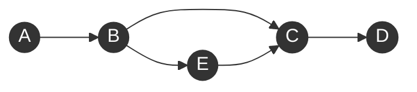
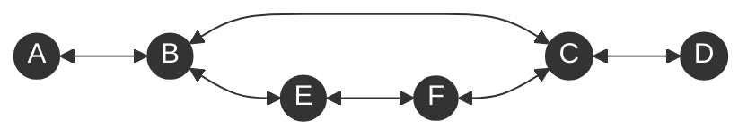

### 1. Binary Search
- 寻找两个连续的互斥区域的边界
```java
class Solution {
    public int searchInsert(int[] nums, int target) {
        int left = -1;
        int right = nums.length;

        while (left + 1 != right) {
            int mid = left + (right - left) / 2;
            if (nums[mid] >= target) {
                right = mid;
            } else {
                left = mid;
            }
        }

        return right;
    }
}
```

- 左右边界包含了可能的答案
```python
class Solution {
    public int findPeakElement(int[] nums) {
        int left = -1;
        int right = nums.length;

        while (left + 1 != right) {
            int mid = left + (right - left) / 2;

            if (isUp(nums, mid)) {
                left = mid;
            } else {
                right = mid;
            }
        }

        return right;
    }

    public boolean isUp(int[] nums, int idx) {
        return idx + 1 < nums.length && nums[idx] < nums[idx + 1];
    }
}
```
- 寻找某个数
```java
class Solution {
    public int search(int[] nums, int target) {
        int left = 0;
        int right = nums.length - 1;

        while (left <= right) {
            int mid = left + (right - left) / 2;

            if (nums[mid] == target) {
                return mid;
            }

            if (nums[mid] < target) {
                left = mid + 1;
            } else {
                right = mid - 1;
            }
        }

        return -1;
    }
}
``` 

### 2. Prefix Sum
- 前缀和数组
```java
class NumArray {
    int[] pre;
    public NumArray(int[] nums) {
        pre = new int[nums.length + 1];
        for (int i=1; i<pre.length; i++) {
            pre[i] = pre[i - 1] + nums[i - 1];
        }
    }
    
    public int sumRange(int left, int right) {
        return pre[right + 1] - pre[left];
    }
}
```

- 前缀后缀和
```java
class Solution {
    public long maximumSumScore(int[] nums) {
        long[] pre = new long[nums.length];
        pre[0] = nums[0];

        for (int i=1; i<pre.length; i++) {
            pre[i] = pre[i - 1] + nums[i];
        }

        long[] suf = new long[nums.length];
        suf[nums.length - 1] = nums[nums.length - 1];

        for (int i=suf.length - 2; i>=0; i--) {
            suf[i] = suf[i + 1] + nums[i];
        }

        long max = Long.MIN_VALUE;

        for (int i=0; i<nums.length; i++) {
            max = Math.max(max, Math.max(pre[i], suf[i]));
        }

        return max;
    }
}
```

- 查看以当前位置为结尾的子数组和的性质
```java
class Solution {
    public boolean checkSubarraySum(int[] nums, int k) {
        int sum = 0;
        Map<Integer, Integer> map = new HashMap<>();
        map.put(0, -1);

        for (int i=0; i<nums.length; i++) {
            sum += nums[i];

            if (map.containsKey(sum % k) && i - map.get(sum % k) >= 2) {
                return true;
            }

            if (!map.containsKey(sum % k)) {
                map.put(sum % k, i);
            }
        }

        return false;
    }
}
```

### 3. Sort Method
- Rainbow Sort
```java
class Solution {
    public void sortColors(int[] nums) {
        int i = 0;
        int j = 0;
        int k = nums.length - 1;

        while (j <= k) {
            if (nums[j] == 0) {
                swap(nums, i++, j++);
            } else if (nums[j] == 1) {
                j++;
            } else {
                swap(nums, j, k--);
            }
        }
    }

    public void swap(int[] nums, int i, int j) {
        int tmp = nums[i];
        nums[i] = nums[j];
        nums[j] = tmp;
    }
}
```

- Merge Sort
```java
class Solution {
    int[] tmp;

    public int[] sortArray(int[] nums) {
        tmp = new int[nums.length];
        mergeSort(nums, 0, nums.length - 1);
        return nums;
    }

    public void mergeSort(int[] nums, int left, int right) {
        if (left == right) {
            return;
        }

        int mid = left + (right - left) / 2;
        mergeSort(nums, left, mid);
        mergeSort(nums, mid + 1, right);

        merge(nums, left, mid, right);
    }

    public void merge(int[] nums, int left, int mid, int right) {
        for (int i=left; i<=right; i++) {
            tmp[i] = nums[i];
        }

        int i = left;
        int j = mid + 1;
        int k = left;

        while (i <= mid && j <= right) {
            if (tmp[i] <= tmp[j]) {
                nums[k++] = tmp[i++];
            } else {
                nums[k++] = tmp[j++];
            }
        }

        while (i <= mid) {
            nums[k++] = tmp[i++];
        }
    }
}
```

- Quick Sort
```java
class Solution {
    Random rand;
    public int[] sortArray(int[] nums) {
        rand = new Random();
        quickSort(nums, 0, nums.length - 1);
        return nums;
    }

    public void quickSort(int[] nums, int left, int right) {
        if (left >= right) {
            return;
        }

        int pvt = left + rand.nextInt(right - left + 1);
        swap(nums, pvt, right);
        int i = left;
        int j = left;
        int k = right - 1;

        while (j <= k) {
            if (nums[j] < nums[right]) {
                swap(nums, i++, j++);
            } else if (nums[j] == nums[right]) {
                j++;
            } else {
                swap(nums, j, k--);
            }
        }

        swap(nums, j, right);
        quickSort(nums, left, i - 1);
        quickSort(nums, j + 1, right); 
    }

    public void swap(int[] nums, int i, int j) {
        int tmp = nums[i];
        nums[i] = nums[j];
        nums[j] = tmp;
    }
}
```

### 4. 3Sum
```java
// 任意解都能被这种方法覆盖 所以不会漏解
class Solution {
    public List<List<Integer>> threeSum(int[] nums) {
        List<List<Integer>> rst= new ArrayList<>();

        Arrays.sort(nums);
        for (int i=0; i<nums.length; i++) {
            List<List<Integer>> lists = twoSum(nums, i + 1, -nums[i]);

            for (List<Integer> list : lists) {
                list.add(nums[i]);
                rst.add(list);
            }

            while (i + 1 < nums.length && nums[i] == nums[i + 1]) {
                i++;
            }
        }

        return rst;
    }

    public List<List<Integer>> twoSum(int[] nums, int idx, int target) {
        List<List<Integer>> list = new ArrayList<>();
        int left = idx;
        int right = nums.length - 1;

        while (left < right) {
            int total = nums[left] + nums[right];

            if (total > target) {
                right--;
            } else if (total < target) {
                left++;
            } else {
                list.add(new ArrayList(Arrays.asList(nums[left], nums[right])));

                int val = nums[left];
                while(left < right && nums[left] == val) {
                    left++;
                }
            }
        }

        return list;
    }
}
```

### 5. Sliding Window
- 不定长滑动窗口
```java
//前提是问题性质会随着窗口边界单调变化
//在最外层循环[left, right)不满足有重复字符条件
class Solution {
    public int lengthOfLongestSubstring(String s) {
        int left = 0;
        int right = 0;
        int max = 0;
        Map<Character, Integer> map = new HashMap<>();

        while (right < s.length()) {
            char rc = s.charAt(right);
            map.put(rc, map.getOrDefault(rc, 0) + 1);

            while (map.get(rc) > 1) {
                char lc = s.charAt(left);
                map.put(lc, map.get(lc) - 1);
                left++;
            }

            max = Math.max(max, right - left + 1);
            right++;
            
        }

        return max;
    }
}
```

- 定长滑动窗口
```java
class Solution {
    public boolean checkInclusion(String s1, String s2) {
        Map<Character, Integer> smap = new HashMap<>();
        Map<Character, Integer> rmap = new HashMap<>();

        for (int i=0; i<s1.length(); i++) {
            char c = s1.charAt(i);
            rmap.put(c, rmap.getOrDefault(c, 0) + 1);
        }

        int left = 0;
        int right = 0;
        int match = 0;

        while (right < s2.length()) {
            char rc = s2.charAt(right);

            smap.put(rc, smap.getOrDefault(rc, 0) + 1);

            if (rmap.containsKey(rc) && rmap.get(rc) == smap.get(rc) + 0) {
                match++;
            } 

            while (right - left + 1 > s1.length()) {
                char lc = s2.charAt(left);
                if (rmap.containsKey(lc) && rmap.get(lc) == smap.get(lc) + 0) {
                    match--;
                }
                smap.put(lc, smap.get(lc) - 1);
                left++;         
            }

            if (match == rmap.size()) {
                return true;
            }

            right++;
        }

        return false;
    }
}
```
### 6. Recursion
```java
//截取从idx开始最长为k: for (int i=idx; i<idx + k; i++) -> s.substring(idx, i + 1)
class Solution {
    Map<Integer, Boolean> memo = new HashMap<>();
    Set<String> set;

    public boolean wordBreak(String s, List<String> wordDict) {
        set = new HashSet<>(wordDict);
        return dfs(s, 0);
    }

    public boolean dfs(String s, int idx) {
        if (memo.containsKey(idx)) {
            return memo.get(idx);
        }

        if (idx == s.length()) {
            return true;
        }

        for (int i=idx+1; i<=s.length(); i++) {
            String str = s.substring(idx, i);

            if (set.contains(str) && dfs(s, i)) {
                memo.put(idx, true);
                return true;
            }
        }

        memo.put(idx, false);
        return false;
    }
}
```

### 7. Palindrome
- 中心开花
```java
class Solution {
    public int countSubstrings(String s) {
        int num = 0;
        for (int i=0; i<s.length(); i++) {
            num += find(s, i, i);
            num += find(s, i , i + 1);
        }

        return num;
    }

    public int find(String s, int left, int right) {
        int num = 0;

        while (left >= 0 && right < s.length() && s.charAt(left) == s.charAt(right)) {
            num++;
            left--;
            right++;
        }

        return num;
    }
}
```

- 双指针
```java
class Solution {
    public boolean isPalindrome(String s) {
        int left = 0;
        int right = s.length() - 1;

        while (left < right) {
            if (s.charAt(left) != s.charAt(right)) {
                return false;
            }
            left++;
            right--;
        }

        return true;
    }
}
```

### 8. Monotonic Stack / Queue
-  Monotonic Stack
```java
class Solution {
    public int largestRectangleArea(int[] heights) {
        Deque<Integer> stk = new ArrayDeque<>();
        int max = 0;

        for (int i=0; i<heights.length; i++) {
            while (!stk.isEmpty() && heights[stk.peekLast()] > heights[i]) {
                int h = heights[stk.pollLast()];
                int right = i - 1;
                int left = stk.isEmpty()? 0 : stk.peekLast() + 1;

                max = Math.max(max, h * (right - left + 1));

            } 

            stk.offerLast(i);
        }

        while (!stk.isEmpty()) {
            int h = heights[stk.pollLast()];
            int right = heights.length - 1;
            int left = stk.isEmpty()? 0 : stk.peekLast() + 1;

            max = Math.max(max, h * (right - left + 1));
        }

        return max;
    }
}
```

- Monotonic Queue
```java
class Solution {
    public int[] maxSlidingWindow(int[] nums, int k) {
        Deque<Integer> dq = new ArrayDeque<>();

        int left = 0;
        int right = 0;
        int t = 0;

       int[] rst = new int[nums.length - k + 1];

        while (right < nums.length) {
            while (!dq.isEmpty() && nums[dq.peekLast()] < nums[right]){
                dq.pollLast();
            } 
            dq.offerLast(right);

            while (right - left + 1 > k) {
                if (left == dq.peekFirst()) {
                    dq.pollFirst();
                }
                left++;
            }

            if (right - left + 1 == k) {
                rst[t++] = nums[dq.peekFirst()];
            }

            right++;
        }

        return rst;
    }
}
```

```java
class Solution {
    public int longestSubarray(int[] nums, int limit) {
        Deque<Integer> maxq = new ArrayDeque<>();
        Deque<Integer> minq = new ArrayDeque<>();

        int left = 0;
        int right = 0;

        int max = 0;

        while (right < nums.length) {
            while (!maxq.isEmpty() && maxq.peekLast() < nums[right]) {
                maxq.pollLast();
            }
            maxq.offerLast(nums[right]);

            while (!minq.isEmpty() && minq.peekLast() > nums[right]) {
                minq.pollLast();
            }
            minq.offerLast(nums[right]);

            while (maxq.peekFirst() - minq.peekFirst() > limit) {
                if (nums[left] == maxq.peekFirst() + 0) {
                    maxq.pollFirst();
                }

                if (nums[left] == minq.peekFirst() + 0) {
                    minq.pollFirst();
                }

                left++;
            }

            max = Math.max(right - left + 1, max);
            right++;
        }

        return max;
    }
}
```

### 9. Union Find
```java
//Every edge means the connectivity between two nodes, and in union find this connectivity is represented by two nodes share the same root node
class Solution {
    public int countComponents(int n, int[][] edges) {
        UF uf = new UF(n);

        for (int[] edge : edges) {
            uf.connect(edge[0], edge[1]);
        }

        return uf.cnt;
    }
}

class UF{
    int[] pnt;
    int cnt;

    public UF(int n) {
        cnt = n;
        pnt = new int[n];

        for (int i=0; i<pnt.length; i++) {
            pnt[i] = i;
        }
    }

    public int find(int x) {
        if (x == pnt[x]) {
            return pnt[x];
        }

        return find(pnt[x]);
    }

    public void connect(int p, int q) {
        int proot = find(p);
        int qroot = find(q);

        if (proot == qroot) {
            return;
        }

        pnt[proot] = qroot;
        cnt--;
    }

    public boolean isConnected(int p, int q) {
        return find(p) == find(q);
    }
}
```

### 10. Binary Tree
- All iteration + return value
```java
// dfs(subnode)本身代表了访问之后没有访问过的所有点，所以返回值也带有之后整体的意思；然后用返回值考虑以当前节点为根子树的性质是否满足
class Solution {
    boolean is_balanced = true;

    public boolean isBalanced(TreeNode root) {
        dfs(root);
        return is_balanced;
    }

    public int dfs(TreeNode root) {
        if (root == null) {
            return 0;
        }

        int left = dfs(root.left);
        int right = dfs(root.right);

        if (Math.abs(left - right) > 1) {
            is_balanced = false;
        }

        return Math.max(left, right) + 1;
    }
}

class Solution {
    public boolean isBalanced(TreeNode root) {
        return dfs(root) == -1? false : true;
    }

    public int dfs(TreeNode root) {
        if (root == null) {
            return 0;
        }

        int left = dfs(root.left);
        int right = dfs(root.right);

        if (left == -1 || right == -1 || Math.abs(left - right) > 1) {
            return -1;
        }

        return Math.max(left, right) + 1;
    }
}
```

### 11. Graph DFS

| 图类型 | 环检测方法 | 原因                   |     |
| --- | ----- | -------------------- | --- |
| 有向图 | 三色标记  | 需要区分"在当前路径上"vs"已探索完" |     |
| 无向图 | 父节点检查 | 只要回到访问过的非父节点就是环      |     |

- 有向图


- 无向图


- 非连通有向图判环
```java
// DAG的话，相邻如果访问过的话一定是状态2（无环）
class DirectedGraphCycleDetection {
    Map<Integer, Integer> gp = new HashMap<>();  // 状态：1=灰色，2=黑色
    Map<Integer, List<Integer>> out = new HashMap<>();
    
    public boolean hasCycle(int numNodes, int[][] edges) {
        // 构建邻接表（单向）
        for (int[] edge : edges) {
            out.putIfAbsent(edge[0], new ArrayList<>());
            out.get(edge[0]).add(edge[1]);
        }

        // 对每个未访问节点进行DFS
        for (int i = 0; i < numNodes; i++) {
            if (!gp.containsKey(i) && dfs(i)) {
                return true;
            }
        }
        return false;
    }

    public boolean dfs(int node) {
        gp.put(node, 1);  // 标记为灰色（正在访问）

        for (int nei : out.getOrDefault(node, new ArrayList<>())) {
            if (!gp.containsKey(nei)) {
                if (dfs(nei)) {
                    return true;
                }
            } else if (gp.get(nei) == 1) {  // 遇到灰色节点=有环
                return true;
            }
        }
        
        gp.put(node, 2);  // 标记为黑色（访问完成）
        return false;
    }
}
```

- 非连通有向图src->dst所有路径
```java
// 这个代码对有向图和无向图都适用！
class Solution {
    List<List<Integer>> result = new ArrayList<>();
    List<Integer> path = new ArrayList<>();
    int[] state;
    
    public List<List<Integer>> allPaths(List<List<Integer>> graph, int src, int dst) {
        int n = graph.size();
        state = new int[n];
        
        // 可选的优化：预检查
        // if (!canReach(graph, src, dst)) return result;
        
        dfs(graph, src, dst);
        return result;
    }
    
    private void dfs(List<List<Integer>> graph, int node, int dst) {
        if (node == dst) {
            path.add(dst);
            result.add(new ArrayList<>(path));
            path.remove(path.size() - 1);
            return;
        }
        
        path.add(node);
        state[node] = 1;
        
        for (int nei : graph.get(node)) {
            if (state[nei] != 1) {
                dfs(graph, nei, dst);
            }
        }
        
        path.remove(path.size() - 1);
        state[node] = 2;
    }
}
```

- 非连通有向图访问每个节点一次
```java
class Solution {
    int[] state;
    List<List<Integer>> graph;
    
    // 只是访问所有节点
    public void dfsAllNodes(List<List<Integer>> graph) {
        this.graph = graph;
        int n = graph.size();
        state = new int[n];
        
        for (int i = 0; i < n; i++) {
            if (state[i] == 0) {
                dfs(i);
            }
        }
    }
    
    private void dfs(int node) {
        state[node] = 1;
        
        for (int nei : graph.get(node)) {
            if (state[nei] == 0) {  // 只访问未访问的
                dfs(nei);
            }
            // 忽略 IN_PATH 和 VISITED 的节点
        }
        
        state[node] = 2;
    }
}
```

- 非连通无向图判环
```java
class UndirectedGraphCycleDetection {
    Map<Integer, Boolean> visited = new HashMap<>();  // 只需要记录是否访问
    Map<Integer, List<Integer>> adj = new HashMap<>();  // adj比out更符合无向图
    
    public boolean hasCycle(int numNodes, int[][] edges) {
        // 构建邻接表（双向！）
        for (int[] edge : edges) {
            adj.putIfAbsent(edge[0], new ArrayList<>());
            adj.putIfAbsent(edge[1], new ArrayList<>());
            adj.get(edge[0]).add(edge[1]);
            adj.get(edge[1]).add(edge[0]);  // 关键区别：双向边
        }

        // 对每个未访问节点进行DFS
        for (int i = 0; i < numNodes; i++) {
            if (!visited.containsKey(i) && dfs(i, -1)) {  // 传入parent=-1
                return true;
            }
        }
        return false;
    }

    public boolean dfs(int node, int parent) {  // 需要parent参数
        visited.put(node, true);  // 只需要标记访问（相当于灰色）

        for (int nei : adj.getOrDefault(node, new ArrayList<>())) {
            if (!visited.containsKey(nei)) {
                if (dfs(nei, node)) {  // 传递当前节点作为parent
                    return true;
                }
            } else if (nei != parent) {  // 关键区别：已访问且不是父节点=有环
                return true;
            }
        }
        
        // 不需要标记黑色！
        return false;
    }
}
```

- 非连通无向图src->dst所有路径
```java
//找所有路径**：`if (state[nei] != 1)` - 递归状态0和状态2
public void dfsAllPaths(int node, int dst) {
    if (node == dst) {
        // 记录路径
        return;
    }
    
    state[node] = 1;  // 进入时标记
    
    for (int nei : graph[node]) {
        if (state[nei] != 1) {  // 对状态0和状态2都递归！
            dfsAllPaths(nei, dst);
        }
    }
    
    state[node] = 2;  // 这里是关键区别：不是永久的！
    // 实际上等价于 state[node] = 0，允许被重新访问
}
```
```java
class Solution {
    // Union Find 部分
    class UnionFind {
        int[] parent;
        int count;
        
        UnionFind(int n) {
            parent = new int[n];
            for (int i = 0; i < n; i++) {
                parent[i] = i;
            }
            count = n;
        }
        
        int find(int x) {
            if (parent[x] != x) {
                parent[x] = find(parent[x]);  // 路径压缩
            }
            return parent[x];
        }
        
        void union(int x, int y) {
            int px = find(x), py = find(y);
            if (px == py) return;
            parent[px] = py;
        }
        
        boolean isConnected(int x, int y) {
            return find(x) == find(y);
        }
    }
    
    // 找所有路径部分
    List<List<Integer>> result = new ArrayList<>();
    List<Integer> path = new ArrayList<>();
    int[] state;  // 使用三种状态
    
    public List<List<Integer>> allPaths(List<List<Integer>> graph, int src, int dst) {
        int n = graph.size();
        
        // Step 1: 构建 Union Find
        UnionFind uf = new UnionFind(n);
        for (int u = 0; u < n; u++) {
            for (int v : graph.get(u)) {
                uf.union(u, v);
            }
        }
        
        // Step 2: 检查连通性
        if (!uf.isConnected(src, dst)) {
            return result;  // 不连通，直接返回空结果
        }
        
        // Step 3: 连通则进行 DFS
        state = new int[n];  // 初始都是 UNVISITED
        dfs(graph, src, dst);
        return result;
    }
    
    private void dfs(List<List<Integer>> graph, int node, int dst) {
        if (node == dst) {
            path.add(dst);
            result.add(new ArrayList<>(path));
            path.remove(path.size() - 1);
            return;
        }
        
        path.add(node);
        state[node] = 1;  // 标记为在当前路径中
        
        for (int nei : graph.get(node)) {
            // 关键：对 UNVISITED 和 VISITED 都递归
            if (state[nei] != 1) {  
                dfs(graph, nei, dst);
            }
        }
        
        path.remove(path.size() - 1);
        state[node] = 2;  // 标记为已访问但可重访
    }
}
```

- 非连通无向图访问每个节点一次
```java
public void dfs(int node) {
    state[node] = 1;  // 进入时标记为"正在访问"
    
    for (int nei : graph[node]) {
        if (state[nei] == 0) {  // 只对未访问的递归
            dfs(nei);
        }
    }
    
    state[node] = 2;  // 完成时标记为"访问完成"
}
```
```java
class Solution {
    int[] state;  // 0:未访问, 1:在当前路径中, 2:访问完成
    List<List<Integer>> graph;
    
    public void dfsAllNodes(List<List<Integer>> graph) {
        this.graph = graph;
        int n = graph.size();
        state = new int[n];  // 初始都是0
        
        // 外层循环处理所有连通分量
        for (int i = 0; i < n; i++) {
            if (state[i] == 0) {  // 只从未访问的节点开始
                dfs(i);
            }
        }
    }
    
    private void dfs(int node) {
        state[node] = 1;  // 进入时标记为"正在访问"
        
        for (int nei : graph.get(node)) {
            if (state[nei] == 0) {  // 只对未访问的递归
                dfs(nei);
            }
            // 如果 state[nei] == 1，说明有环（可选检测）
        }
        
        state[node] = 2;  // 完成时标记为"访问完成"
    }
}
```

### 12. Graph Dijkstra
```java

```


### 13. Graph Bellman
```java
class Solution {
    public int findCheapestPrice(int n, int[][] flights, int src, int dst, int k) {
        int[] curDist = new int[n];
        int[] nxtDist = new int[n];

        Arrays.fill(curDist, Integer.MAX_VALUE);
        Arrays.fill(nxtDist, Integer.MAX_VALUE);

        curDist[src] = 0;
        nxtDist[src] = 0;

        for (int i=0; i<k+1; i++) {
            boolean updated = false;
            System.arraycopy(curDist, 0, nxtDist, 0, n);

            for (int[] flight : flights) {
                int u = flight[0];
                int v = flight[1];
                int w = flight[2];

                if (curDist[u] != Integer.MAX_VALUE && curDist[u] + w < nxtDist[v]) {
                    nxtDist[v] = curDist[u] + w;
                    updated = true;
                }
            }

            if (!updated) {
                break;
            }

            System.arraycopy(nxtDist, 0, curDist, 0, n);
        }

        return curDist[dst] == Integer.MAX_VALUE? -1 : curDist[dst];
    }
}
```


### 14. 二叉树
- dfs2
```java
class Solution {
    int max;
    
    public int longestUnivaluePath(TreeNode root) {
        if (root == null) {
            return 0;
        }
        dfs(root);
        return max;
    }

    public int dfs(TreeNode root) {
        if (root.left == null && root.right == null) {
            return 0;
        }

        int leftArrow = 0;
        if (root.left != null) {
            int left = dfs(root.left);
            if (root.val == root.left.val) {
                leftArrow = left + 1;
            }          
        }

        int rightArrow = 0;
        if (root.right != null) {
            int right = dfs(root.right);
            if (root.val == root.right.val) {
                rightArrow = right + 1;
            }          
        }

        max = Math.max(max, leftArrow + rightArrow);
        return Math.max(leftArrow, rightArrow);
    }
}
```
```java
class Solution {
    int max;
    public int maxAncestorDiff(TreeNode root) {
        dfs(root);
        return max;
    }

    public int[] dfs(TreeNode root) {
        if (root.left == null && root.right == null) {
            return new int[] {root.val, root.val};
        }

        int[] rst = new int[] {root.val, root.val};

        if (root.left != null) {
            int[] left = dfs(root.left);
            rst[0] = Math.min(rst[0], left[0]);
            rst[1] = Math.max(rst[1], left[1]);
            max = Math.max(max, Math.abs(root.val - left[0]));
            max = Math.max(max, Math.abs(root.val - left[1]));
        }

        if (root.right != null) {
            int[] right = dfs(root.right);
            rst[0] = Math.min(rst[0], right[0]);
            rst[1] = Math.max(rst[1], right[1]);
            max = Math.max(max, Math.abs(root.val - right[0]));
            max = Math.max(max, Math.abs(root.val - right[1]));
        }

        return rst;
    }
}
```
```java
class Solution {
    int max;
    public int longestZigZag(TreeNode root) {
        dfs(root);
        return max;
    }

    public int[] dfs(TreeNode root) {
        if (root.left == null && root.right == null) {
            return new int[]{0, 0};
        }

        int[] rst = new int[]{0, 0};

        if (root.left != null) {
            int[] left = dfs(root.left);
            rst[0] += (left[1] + 1);
        }

        if (root.right != null) {
            int[] right = dfs(root.right);
            rst[1] += (right[0] + 1);
        }

        max = Math.max(max, Math.max(rst[0], rst[1]));
        return rst;
    }
}
```

- BFS
```java
class Solution {
    public List<List<Integer>> zigzagLevelOrder(TreeNode root) {
        if (root == null) return new ArrayList<>();
        List<List<Integer>> rst = new ArrayList<>();
        Deque<TreeNode> q = new ArrayDeque<>();

        boolean flag = true;
        q.offerFirst(root);

        while (!q.isEmpty()) {
            int size = q.size();
            List<Integer> list = new ArrayList<>();

            if (flag) {
                for (int i=0; i<size; i++) {
                    TreeNode cur = q.pollFirst();
                    list.add(cur.val);

                    if (cur.left != null) {
                        q.offerLast(cur.left);
                    }

                    if (cur.right != null) {
                        q.offerLast(cur.right);
                    }
                }
            } else {
                for (int i=0; i<size; i++) {
                    TreeNode cur = q.pollLast();
                    list.add(cur.val);

                    if (cur.right != null) {
                        q.offerFirst(cur.right);
                    }

                    if (cur.left != null) {
                        q.offerFirst(cur.left);
                    }
                }
            }

            flag = !flag;
            rst.add(new ArrayList(list));
        }

        return rst;
    }
}
```
```java
class Solution {
    public int widthOfBinaryTree(TreeNode root) {
        Deque<TreeNode> dq = new ArrayDeque<>();
        Map<TreeNode, Integer> map = new HashMap<>();

        dq.offerLast(root);
        map.put(root, 1);

        int max = 0;
        while (!dq.isEmpty()) {
            int size = dq.size();

            int left = map.get(dq.peekFirst());
            int right = map.get(dq.peekLast());
            max = Math.max(max, right - left + 1);

            for (int i=0; i<size; i++) {
                TreeNode cur = dq.pollFirst();
                
                if (cur.left != null) {
                    dq.offerLast(cur.left);
                    map.put(cur.left, 2 * map.get(cur));
                }

                if (cur.right != null) {
                    dq.offerLast(cur.right);
                    map.put(cur.right, 2 * map.get(cur) + 1);
                }
            }
        }

        return max;
    }
}
```
